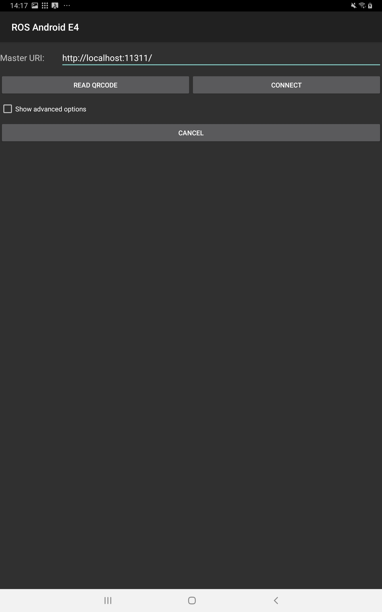
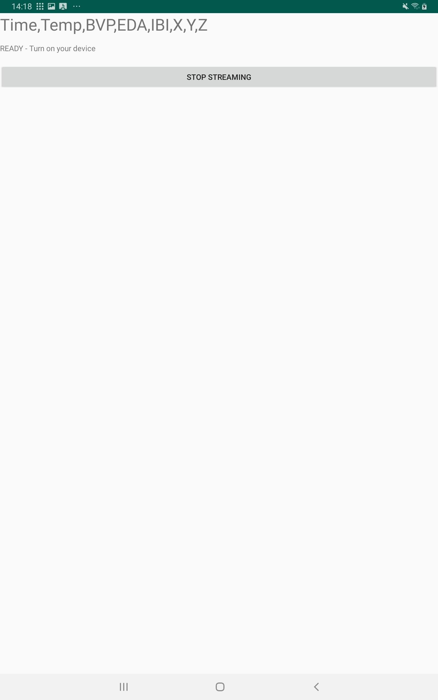

# Ros Android E4
This is an android application that merges the example projects of using
ROS and Empatica on Android.


## Requirements

* Android Studio
* Empatica E4 wristband
* [Empatica module] for ROS
* Empatica API key
* Empatica library (empalink)


## Setup
First, download the android project.

```
git clone https://github.com/MonicaPH/ros_android_e4.git
```

Next, download the Empatica library empalink from the Empatica homepage and copy
it in the libs folder of this project. Open Android studio and click to
`Open an existing Android Studio project`. Navigate to the `ros_android_e4`
folder and press open.

In line 54 of `MainActivity.java` enter your Empatica API key. This is needed
to use the empalink library and connect with any Empatica wristband. The key
that is currently in the project does not work.

In the menu select `Build -> Make project` or press the play icon in the icon
bar. The popup menu for `Open edit Run/Debug configurations dialog` should be
set to `ros_android_E4`.


## Run app on Device
To install apps on your device it has to be in debug mode. Open Settings and
check if you have `Developer options`.

__If not__: locate the Build number inside the settings. Tap 7 times on the
build number entry in the menu to activate the developer options. In developer
options activate USB debugging.

__If yes__: Activate USB debugging.

Connect your device to the computer and click the play icon in Android studio to
upload and start the app. Your device might ask for authorisation to allow the
computer to upload the app.

Once started, you should see something like this:


In the input field for master URI replace localhost with the IP address of the
computer running ROS. Your android device and the ROS computer need to be in the
same network. Then press connect. If the app connected successfully to ROS
after pressing connect, the screen changes and will show this:


At this point the app might ask for permission to use the location of the device.
Now it is time to start the Empatica wristband. The led of the wristband should
flash in a light blue (cyan) when it is connecting.
After the wristband connected to the app, sensor values will be streamed to ROS
and shown on the screen in real-time.

[Empatica module]: https://github.com/MonicaPH/ros_empatica_logger
